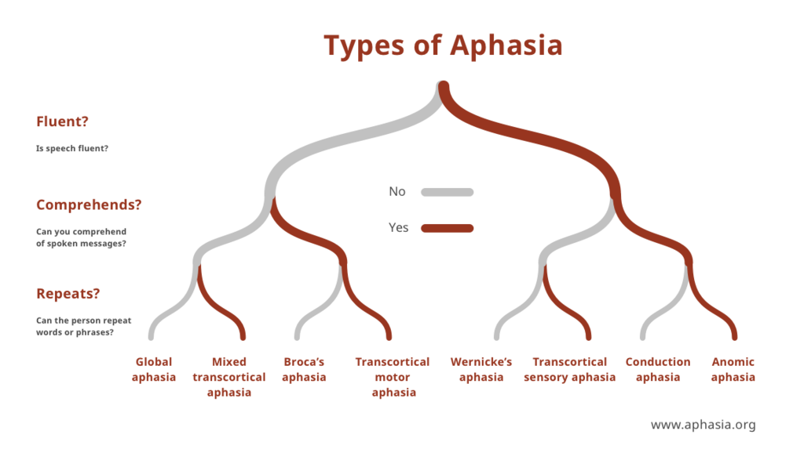

# Language impairment algorithm

This is an online interactive Checklist for assessment of Language impairment based on Boston classification of aphasia:

And extended to include assesmnt for writing and reading 
To be used by El-Sahel Teaching Hospital neurologgists 

## Usage

Just head to the [online link](https://ultiminator.github.io/Neurology/Aphasia/) and start using it

## Authors
#### Based on:
  - Boston's Classification of aphasia
  - Additional info from "CURRENT Diagnosis & Treatment: Neurology, 3e" for John C.M. Brust.

#### Developers
  - Ahmed Salah ([Ultimintor](https://github.com/Ultiminator))

## Feedback

If you have any feedback, please reach out to me at UltimateAlienForce@Outlook.com

